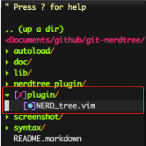
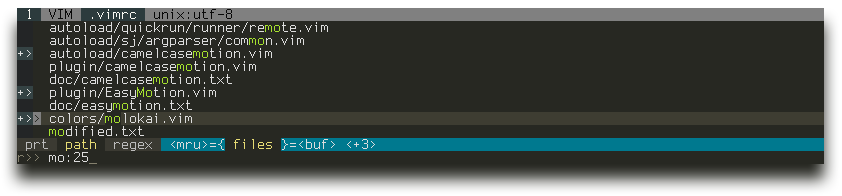
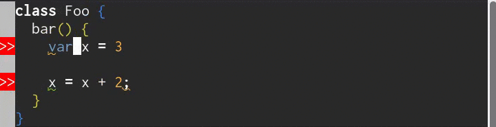
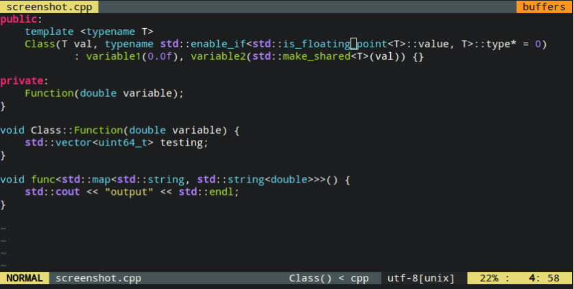
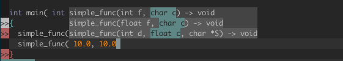
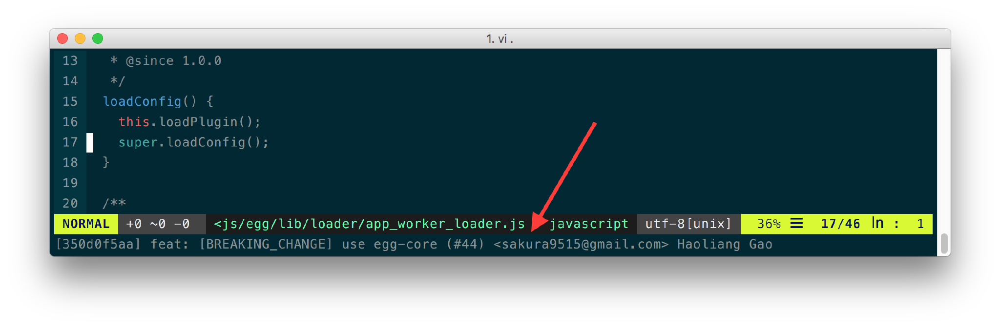

Vim插件整理, 详细设置见vimrc文件

## 依赖

- Vim8: 仅支持Vim 8版本;
- ctags: 用于生成符号列表;

## 安装
>安装之前自行备份好旧配置，清理HOME目录下的所有以`.vim`起始的文件和目录，以免新旧配置相关影响效果

```shell
sh install.sh
```

## 默认集成插件

```shell
" 目录树
Plug 'scrooloose/nerdtree', { 'on':  'NERDTreeToggle' }

" 目录树导航优化
Plug 'jistr/vim-nerdtree-tabs'

" 目录树导航GIT信息
Plug 'Xuyuanp/nerdtree-git-plugin'
```




```shell
" 文件查找
Plug 'kien/ctrlp.vim'
```



```shell
" 自动生成ctags
Plug 'ludovicchabant/vim-gutentags'
```

vim-gutentags配置如下：

```shell
" 启用自动tags生成
let g:gutentags_enabled = 1

" gutentags搜索工程目录的标志，碰到这些文件、目录名就停止向上一级目录递归
let g:gutentags_project_root = ['.root', '.svn', '.git', '.project', '.vimex']

" 所生成的数据文件的名称
let g:gutentags_ctags_tagfile = '.tags'

" 将自动生成的 tags 文件全部放入 ~/.cache/tags 目录中，避免污染工程目录
let s:vim_tags = expand('~/.cache/tags')
let g:gutentags_cache_dir = s:vim_tags

" 检测 ~/.cache/tags 不存在就新建
if !isdirectory(s:vim_tags)
   silent! call mkdir(s:vim_tags, 'p')
endif

" 配置 ctags 的参数
let g:gutentags_ctags_extra_args = ['--fields=+niazS', '--extra=+q']
let g:gutentags_ctags_extra_args += ['--c++-kinds=+pxI']
let g:gutentags_ctags_extra_args += ['--c-kinds=+px']
```

- 变量 gutentags_project_root是vim-gutentags提供的用于搜索工程目录的标志，gutentags插件启动后，会从文件当前路径递归往上查找 gutentags_project_root 中指定的文件或目录名，直到第一次找到对应目标文件或目录名停止。若没有找到 gutentags_project_root 变量指定的文件或目录名，则gutentags不会生成tag文件。
- 变量 gutentags_ctags_tagfile 和 gutentags_cache_dir 分别用于告诉ctags要使用的tag文件目录和tag文件名后缀，tag文件名的生成规则默认是根据生成tag文件的工程绝对路径按 - 分割而成。
- 变量 gutentags_ctags_extra_args 用于配置ctags生成tag标签的参数，具体参数含义可参考文章ctags参数介绍

所以，上面的gutentags配置指定了从当前路径向上递归查找是否有 .root、.svn、 .git、.project、.vimex 等标志性文件来确定当前文档所属的工程目录；而ctags要使用的tag标签文件的路径为 ~/.cache/tags，文件后缀为 .tags

```shell
" 多编程语言语法纠错
Plug 'dense-analysis/ale'
```



```shell
" CPP语法高亮
Plug 'octol/vim-cpp-enhanced-highlight'
```



```shell
" 自动补全
Plug 'ycm-core/YouCompleteMe'
```



```shell
" GOLANG插件
Plug 'fatih/vim-go'
```

```shell
" Vim状态栏插件，包括显示行号，列号，文件类型，文件名，以及Git状态
Plug 'vim-airline/vim-airline'
```

```shell
" Markdown插件
Plug 'iamcco/mathjax-support-for-mkdp'
Plug 'iamcco/markdown-preview.vim'
```

```shell
" 代码GIT提交信息插件
Plug 'zivyangll/git-blame.vim'
```



## 主题配色

默认并没有集成主题配色，个人喜好不同，自己配置吧, 推荐（https://github.com/altercation/vim-colors-solarized）

## vim-plug插件管理

参见[vim-plug](https://github.com/junegunn/vim-plug)文档，进行插件的高效管理
